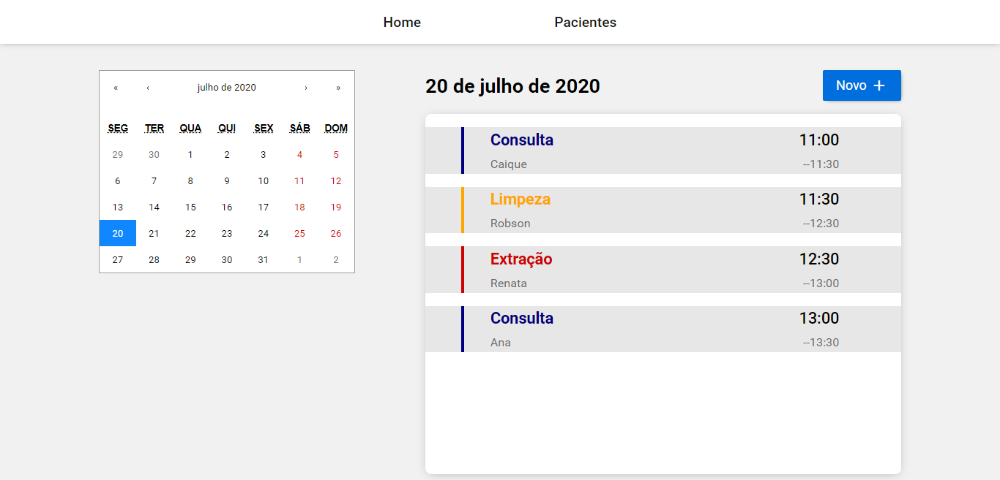

<h1 align="center">Odonto-agenda</h1>

Frontend project built with react

  

## :computer: Built With

- [ReactJS](https://pt-br.reactjs.org/)
- [Redux](https://redux.js.org/)

## :arrow_forward: Getting Started

You need the following tools installed in order to run this project: [Git](https://git-scm.com/) and [Yarn](https://yarnpkg.com/).

1. Clone this repository by running:   `git clone https://github.com/caiquegiovannini/odonto-agenda.git`;
2. Enter the folder running through the terminal:   `cd odonto-agenda`;
3. Run `yarn install` to install the project dependencies;
4. Run `yarn start` to start the development server;
5. Open [http://localhost:3000](http://localhost:3000) to view it in the browser.

## :memo: License

This project is licensed under the MIT License - see the [LICENSE](LICENSE) file for details.

The Odonto-agenda API can be found [here](https://github.com/caiquegiovannini/odonto-agenda-api).

---

Made with :heart: by [Caique Giovannini](https://www.linkedin.com/in/caique-giovannini/)
